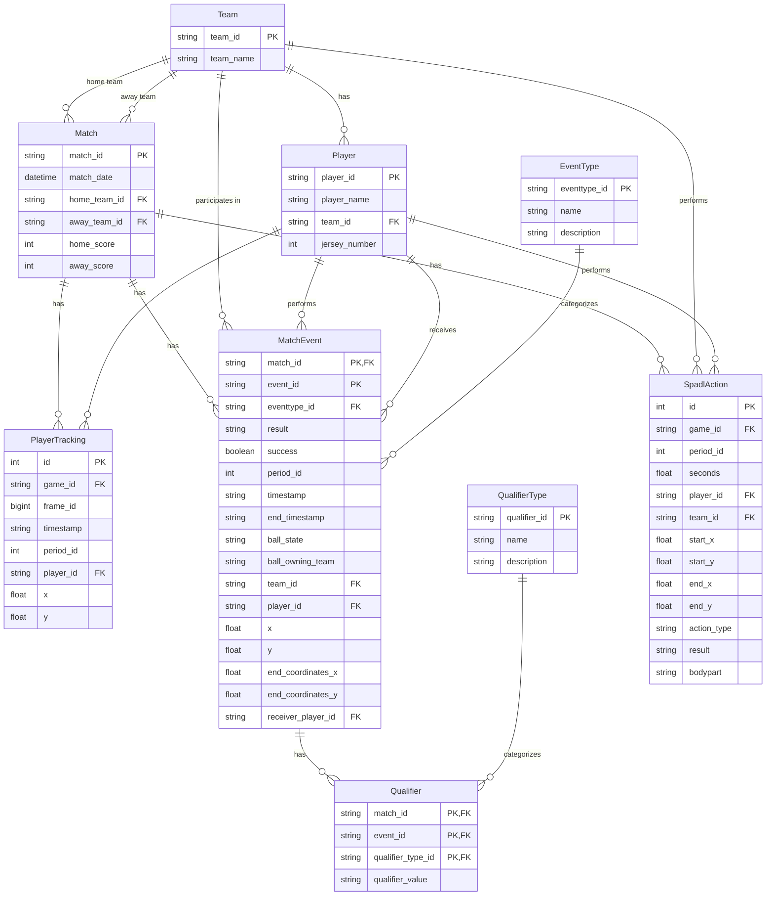

# Soccer Analytics Database Model

This diagram visualizes the database schema for the soccer analytics application.

## Relationship Details

1. **Match and Team**:
   - A Match has one home Team and one away Team
   - A Team can be the home or away Team in many Matches

2. **Team and Player**:
   - A Team has many Players
   - A Player belongs to one Team

3. **Match and MatchEvent**:
   - A Match has many MatchEvents
   - Each MatchEvent belongs to one Match

4. **Player and MatchEvent**:
   - A Player can perform many MatchEvents
   - A Player can receive many MatchEvents (e.g., receiving a pass)
   - MatchEvents can have a Player as performer and another Player as receiver

5. **EventType and MatchEvent**:
   - Each MatchEvent has one EventType
   - An EventType can categorize many MatchEvents

6. **MatchEvent and Qualifier**:
   - A MatchEvent can have many Qualifiers
   - Each Qualifier belongs to one MatchEvent

7. **QualifierType and Qualifier**:
   - Each Qualifier has one QualifierType
   - A QualifierType can be used in many Qualifiers

8. **Match and PlayerTracking**:
   - A Match has many PlayerTracking records
   - Each PlayerTracking record belongs to one Match

9. **Player and PlayerTracking**:
   - A Player has many PlayerTracking records
   - Each PlayerTracking record belongs to one Player

10. **SpadlAction Relationships**:
    - A Match has many SpadlActions
    - A Player can perform many SpadlActions
    - A Team can perform many SpadlActions
<!-- a new table is added: player_position -->
### Explanation of the `player_position` Table

The `player_position` table is a database table designed to store information about the positions of players during soccer matches. Each row in the table represents a specific instance of a player's position at a particular timestamp within a match. The table is populated by processing match data files and extracting player position information.

#### Table Structure
The `player_position` table contains the following columns:
- **`match_id`**: The unique identifier for the match.
- **`player_id`**: The unique identifier for the player.
- **`position`**: A string representing the player's position on the field. This corresponds to the second item in the `PositionType` enum (e.g., "GK" for Goalkeeper, "DEF" for Defender).
- **`timestamp`**: The time during the match when the position was recorded.
- **`period_id`**: The period of the match (e.g., first half, second half).

#### `PositionType` Enum Mapping
The `position` attribute in the `player_position` table is derived from the `PositionType` enum. The second item in each `PositionType` tuple is saved as the `position` string. If you want the exact mappings: [This link](https://people.cs.kuleuven.be/~pieter.robberechts/kloppy/reference/domain/models/position/position/) refers to the mappings we used in the conversion process.

#### Purpose
The `player_position` table is used to:
1. Describe positions during matches.
2. Support advanced analytics, such as heatmaps, pass networks or tactical evaluations.

By storing the `position` as a standardized string (e.g., "GK", "DEF"), the table ensures consistency and facilitates querying and analysis.
